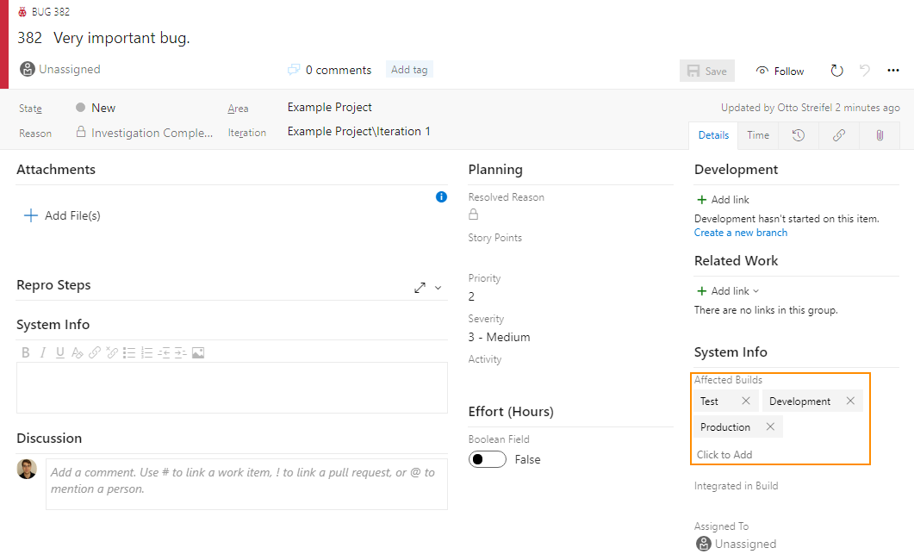

Use data from urls as the suggested values of a multivalue control




# How to get started
## Visual Studio Team Services

Navigate to your work item form customization page and add a rest multivalue control.


Edit the control so it can use the right field to store your selection and the right url/property combination to be displayed. For example
```
https://<account>.visualstudio.com/<project>/_apis/build/definitions?api-version=3.0
```
```
name
```


If the name is specified it look for the first array in the response and get that property of the array of returned objects.

If property: ```name```

Valid response body:
```
{
    value: [
        {name: 'a'},
        {name: 'b'},
        {name: 'c'}
    ]
}
```

If left blank it will look for the first array in the response and use that (response can just be an array of string too). Example response
```
{
    value: ['1','2',3']
}
```


# How to query

The selected values are stored in a semicolon separated format.  To search for items that have a specific value use the "Contains Words" operator.  If searching for multiple values, use multipe "Contains Words" clauses for that field.

Alternatively if the Property field starts with '$' it will use the [JSONPath Syntax](http://jsonpath.com/)

**Example:**

Url
```
https://<account>.visualstudio.com/<project>/_apis/wit/workitemtypes?api-version=3.0
```
Property
```
$.value[*].icon.id
```

# Build 
You can also learn how to build your own custom control extension for the work item form [here](https://www.visualstudio.com/en-us/docs/integrate/extensions/develop/custom-control). 
